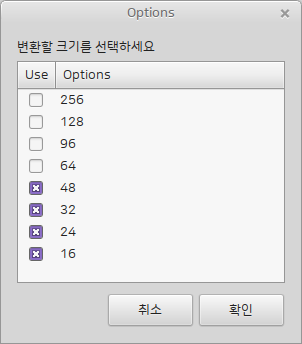

## convert-svg

- svg 파일을 원하는 사이즈로 조정하는 프로그램
- icon 파일의 크기 변환을 일괄로 처리할때 사용하는 유틸리티.
- 하모니카에서 사용되는 프로그램 아이콘을 제작하거나, 아이콘팩을 제작할때 사용

## 실행 프로그램
 * convert-svg : 터미널에서 동작하는 프로그램
 * convert-svg-app : 같은 기능의 GUI 프로그램

## 설치
```
sudo apt update
sudo apt install convert-svg
```

## 사용법
1) `프로그램 > svg 크기 변환 프로그램` 실행 후 원본 svg 파일이 있는 디렉토리를
2) 사이즈를 변환하고 싶은 항목을 선택
3) 선택한 원본 svg 폴더가 있는 디렉토리에 변환된 이미지가 생성됩니다. 



## 이슈 또는 버그
 사용 중 문제를 발견하시면 root@hamonikr.org 또는 https://hamonikr.org 에서 알려주세요.
